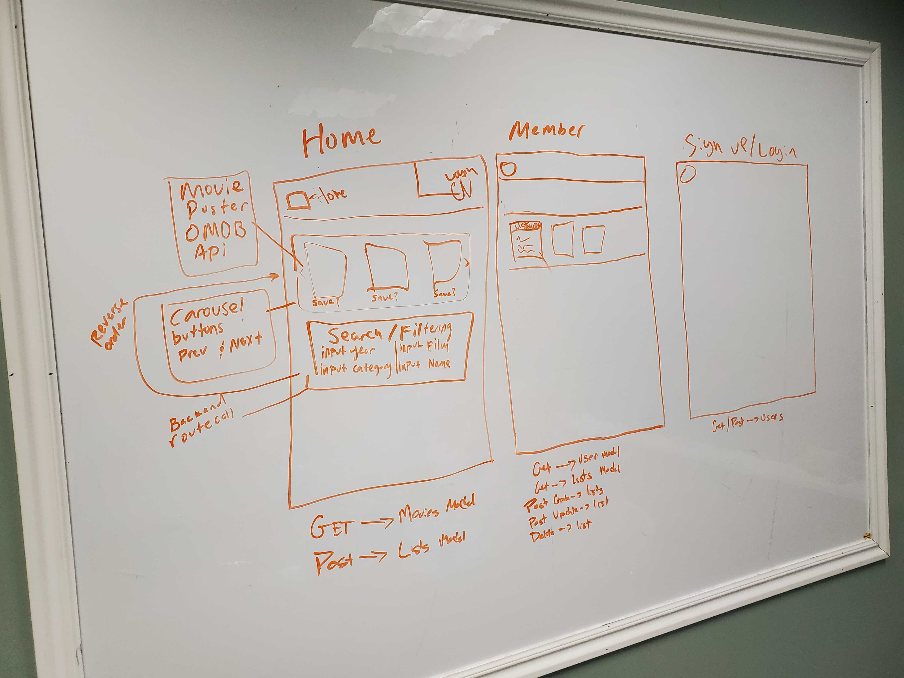
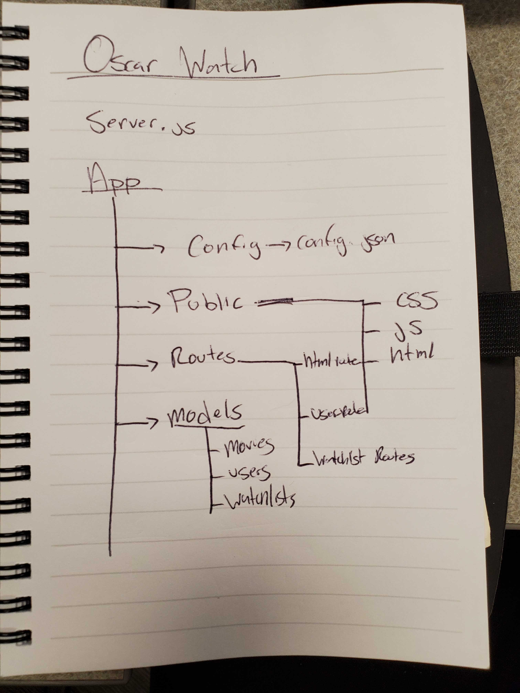

# Oscar-Watch

## <a href="https://project2-oscar-watch.herokuapp.com/">Heroku</a> deployed application

##  <a href="https://github.com/Ericcwong/Oscar-Watch">Github</a> code link

# Collaborators
####  Julie Theriault <a href ="https://github.com/JulieT2319">Github</a>
####  Dan Degeare <a href ="https://github.com/DanDukes">Github</a>
####  Eric Wong <a href ="https://github.com/Ericcwong/">Github</a>
####  Dalton Earl <a href ="https://github.com/Dalton-Earl">Github</a>
####  Cynthia Higley <a href ="https://github.com/CynthiaHigley">Github</a>
 

# Application

### Oscar Watch is an application that allows user to search up movies that have been either nominated for an Oscar or received one. Oscar watch allows users to create an account and create a list of movies they would want to watch. Thus allowing for endless hours of binge watching movies that would leave you captivated till the end! So bust out the popcorn and beverage of choice and get comfortable with Oscar Watch!

# Getting started

### If you want to search for a movie without creating a watchlist. You can enter what criteria you want to search, either being by Category, Nominee Name, Film Nominated, Film Year, Won the Oscar, or by all search parameters to be very specific. Once done with what you want, hit the submit button and cards of movies should pop up right below.

# Images and Gif

# Workflow breakdown
## We broke down what was needed to be done to make this project possible.

# Tech and Features used

#### Materialize
#### JQuery
#### Express
#### Sequelize
#### MySQL
#### Travis
#### OMDB API

# Future add-ons

<li>Fixing the card displays to only show one movie instead of multiple cards.</li>
<li>Movie posters to be more accurate, OMDB API was working but their IMG API wasn't as clear so we opted to use OMDB basic API.</li>
